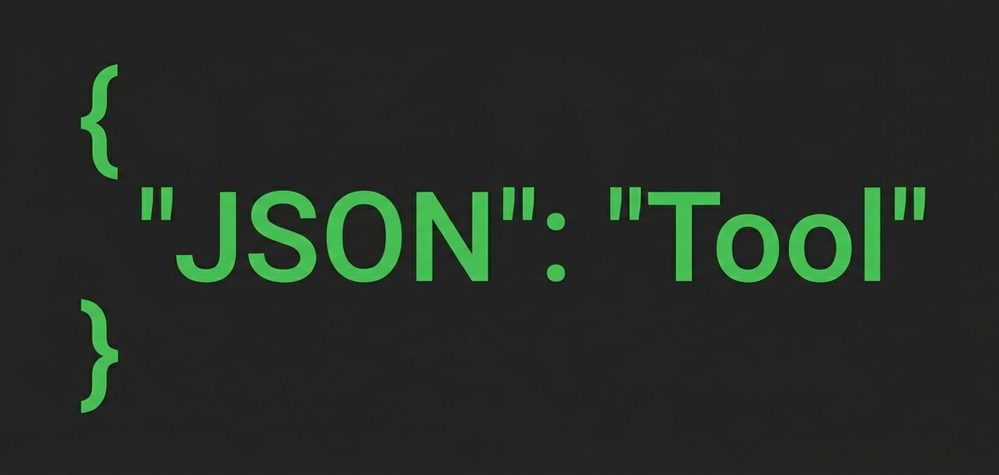

# { JSON Tool }

<p align="center">


</p>


<p align="center">

</p>

---

## ✦ Öne Çıkan Özellikler

### 📊 Derinlemesine Analiz

* **Şema Tespiti:** Farklı obje yapılarını otomatik olarak gruplandırır.
* **Tip Dağılımı:** Veri tiplerini interaktif pasta grafikleriyle görselleştirir.
* **Veri İstatistikleri:** String kelime sayısı, integer frekansı, array uzunlukları gibi detaylar.
* **Eksik Veri Takibi:** `Null` veya `Missing` alanları anında listeler.
* **Görsel Hiyerarşi:** JSON yapısını ağaç (tree) ve iskelet (map) görünümünde sunar.

### 🛠 Veri İşlemleri

* **Merge:** Birden fazla JSON dosyasını tutarlı bir şekilde tek dosyada birleştirir.
* **Trim:** Büyük veri setlerini hızlı önizleme için optimize eder (ilk 100 obje).
* **Dedupe:** Tekrar eden (duplicate) objeleri akıllıca temizler.

### 🎨 Kullanıcı Deneyimi

* **Dark / Light Mode:** Göz yormayan, modern arayüz seçenekleri.
* **Hızlı Aksiyonlar:** Tek tıkla kopyalama ve farklı formatlarda indirme.
* **Modern Tipografi:** *Syne* ve *DM Mono* fontları ile geliştirici dostu okunabilirlik.

---

## 🖼 Uygulama Görselleri

<p align="center">


</p>

<p align="center">


</p>

---

## ⚙ Kurulum ve Başlatma

### Gereksinimler

* **Python 3.8+**
* **pip** (Python paket yöneticisi)

### Adımlar

1. **Repoyu klonlayın:**
```bash
git clone https://github.com/kullanici/json-tool.git
cd json-tool

```


2. **Bağımlılıkları yükleyin:**
```bash
pip install -r requirements.txt

```


3. **Backend sunucusunu başlatın:**
```bash
cd backend
python app.py

```


4. **Tarayıcıda açın:** [http://localhost:5000](https://www.google.com/search?q=http://localhost:5000)

---

## 📁 Dosya Yapısı

```text
json-tool/
├── backend/
│   ├── app.py           # API Route'ları ve Flask yapılandırması
│   └── analyzer.py      # Core analiz ve veri işleme mantığı
├── frontend/
│   ├── index.html       # Ana yapı
│   ├── css/             # Modüler stil dosyaları (Layout, Components)
│   └── js/              # ESM tabanlı state ve render yönetimi
├── assets/              # Uygulama içi görseller ve ikonlar
└── requirements.txt     # Python bağımlılık listesi

```

---

## 🛠 API Referansı

| Endpoint | Method | Açıklama |
| --- | --- | --- |
| `/api/analyze` | `POST` | JSON dosyasını analiz eder ve istatistik döner. |
| `/api/merge` | `POST` | Yüklenen çoklu dosyaları birleştirir. |
| `/api/transform` | `POST` | Trim ve Dedupe işlemlerini uygular. |

---

## 📄 Lisans

Bu proje **MIT Lisansı** altında lisanslanmıştır. Daha fazla bilgi için `LICENSE` dosyasına göz atabilirsiniz.

---
